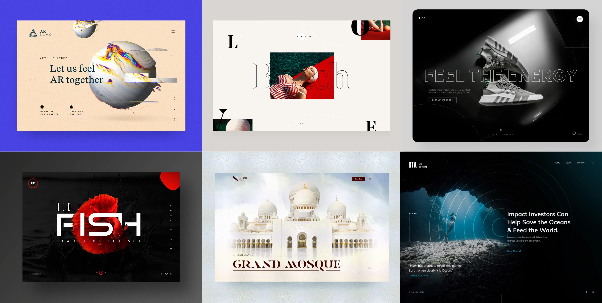
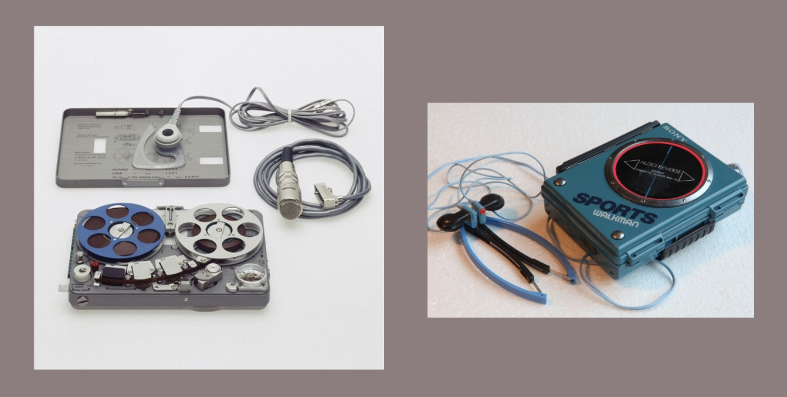

# Dates

du 1er octobre au 19 novembre  
(5 sessions / 15 périodes)

## Brief Site Immersif

Ce deuxième projet sera très différent du précédent: vous allez concevoir un site atypique, sortant de l'ordinaire, visuellement détonnant... un site **immersif**!

Les sites "immersifs" peuvent être utilisés pour développer un *storytelling*, ou pour mettre en valeur un service, un "produit phare".

Quelques exemples dans le domaine des objets technologiques:

- [Nagra, plus de 65 ans d'innovation](https://www.nagraaudio.com/fr/plus-de-65-ans-dinnovation/)
- [Braun Audio](https://braun-audio.com/en-CH/ourtechnology)
- [Oculus Quest 2](https://www.oculus.com/quest-2/)
- [GoPro HERO10 Black](https://gopro.com/fr/fr/shop/cameras/hero10-black/CHDHX-101-master.html)

## Contraintes

Vous travaillerez en groupes de deux, définis aléatoirement.

Chaque binome choisit un objet / appareil, possédant plusieurs fonctionnalités.

Exemples: un tourne-disque, un walkman, une caméra, une calculatrice, un drone, une console de jeu, un couteau suisse, un ustensile de cuisine...

Il doit s'agir d'un objet réel. L'objet peut être ancien ou contemporain. Vous devez avoir accès à un exemplaire pour pouvoir le photographier, filmer, dessiner, sous différents angles.

Nous désignerons ces objets par le terme anglais "*device*".

### Structure du site

Chaque binôme développera une page dédiée à son *device*, faisant partie d'un même site. Votre page devra comporter différentes sections (3 au minimum, 7 au maximum) présentant différents aspects de l'objet.

Les textes devront être en anglais.

### Typographie

Une famille de fontes est imposée pour ce projet: la famille [IBM Plex](https://www.ibm.com/plex/). Vous pourrez utiliser les variantes Sans, Serif, Mono.

### Couleurs

La palette de couleurs du site sera limitée: 

- L'ensemble du site utilisera aux maximum **trois teintes** (en plus du noir et blanc).
- Chaque page utilisera au maximum **deux** parmi ces trois teintes (en plus du noir et du blanc).

## Timing recommandé

- 1 oct : définir les contenus visuels (wireframe, maquette). Définir les teintes autorisées.
- 8 oct : produire les contenus visuels (images, animations).
- 5 nov : développement, structure générale.
- 12 nov : développement, détails et animations.
- 19 nov : développement final.

## Critères d'évaluation

L’évaluation se basera sur trois critères:

- Qualité visuelle (richesse, cohérence, impact)
- Réalisation technique (fichiers média, code)
- Gestion du projet, collaboration
