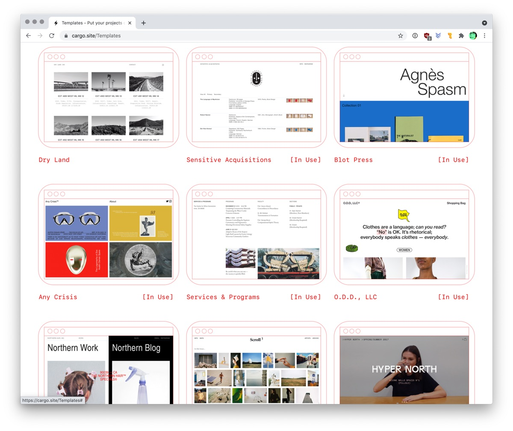

## Recommandations

Méthodes possibles pour créer son portfolio:

- site Cargo - [https://cargo.site/Students](https://cargo.site/Students)
- template Netlify
- codé 100% main ✌️
- WordPress ou autre CMS

## Ressources nom de domaine

Infos concernant les noms de domaine:

- [Cours Web: Noms de domaine](https://cours-web.ch/divers/domaines.html).
- Une [liste d'extensions](https://docs.google.com/spreadsheets/d/1orzB_c24-kh9nZUnYcOhmcXi8IcHGHipT5l6WAwKfLM/edit?usp=sharing) et de leur prix (tarifs Infomaniak).

## Ressources Cargo

Infos concernant cargo:
- Guide d'utilisation: [https://support.cargo.site/](https://support.cargo.site/)
- Cargo est [gratuit pour les étudiants](https://cargo.site/Students). Le code à utiliser pour publier votre site est transmis par Teams.

Exemples de sites portfolio:

- *[10 amazing portfolios from Carnegie Mellon students](https://wf-blog-2021.webflow.io/blog/student-portfolio-examples)*, Webflow Blog.

## Citations

Sur le rôle du portfolio, observations d'Adrian Shaughnessy dans son livre "How to Be a Graphic Designer Without Losing Your Soul" (2005)

Sur le rôle d'un site internet personnel, observations d'Austin Kleon, dans son livre "Show Your Work!" (Montrez votre travail):

