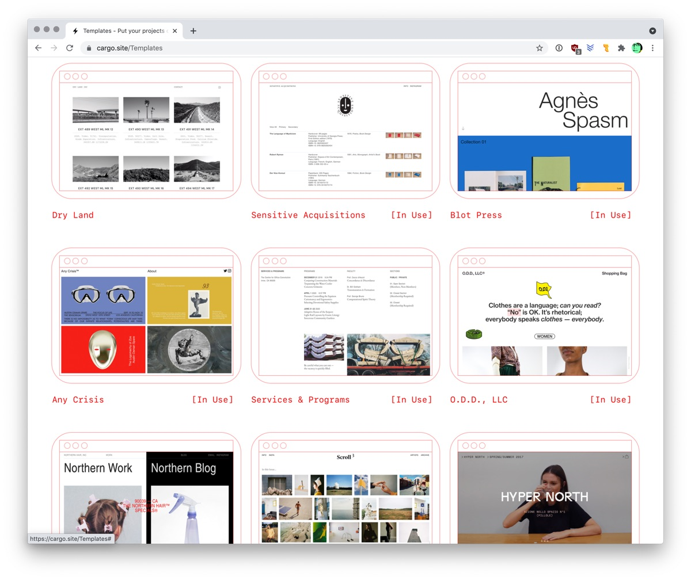

# Infos

du 3 décembre au 14 janvier  
(4 sessions / 12 périodes)

## Recommandations

Méthodes possibles pour créer son portfolio:

- site Cargo - [https://cargo.site/Students](https://cargo.site/Students)
- template Netlify
- codé 100% main ✌️
- WordPress ou autre CMS

## Ressources

Infos concernant les noms de domaine:

- [Cours Web: Noms de domaine](https://cours-web.ch/divers/domaines.html).
- Une [liste d'extensions](https://docs.google.com/spreadsheets/d/1orzB_c24-kh9nZUnYcOhmcXi8IcHGHipT5l6WAwKfLM/edit?usp=sharing) et de leur prix (tarifs Infomaniak).